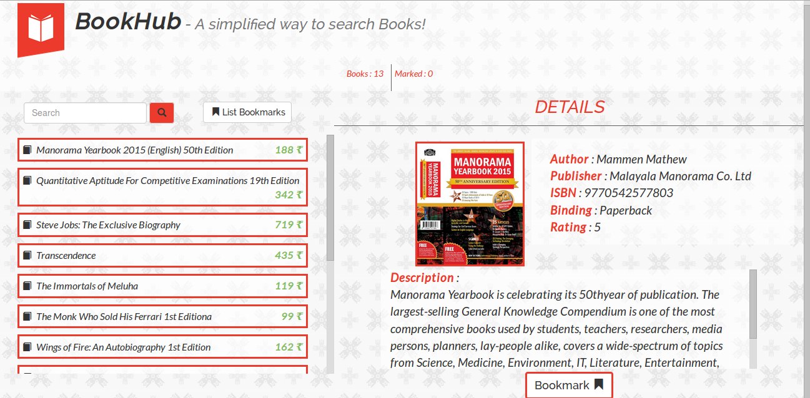

# Capillary BookHub

#### Description :
An online Book Showcase developed for the Capillary Challenge on HackerEarth.

#### Features :
* Reads JSON to display book details
* Books can be bookmarked
* Bookmarked Books can be viewed later
* Overall bookmarks are counted as well as the total number of books
* Responsive
* Books can be Searched for using the Search Bar ** Coming Soon **
* List of Books can be Sorted according to rating or cost ** Coming Soon **

#### ScreenShot :

#### Tech Used :
* HTML
* CSS
* JavaScript
* Twitter Bootstrap
